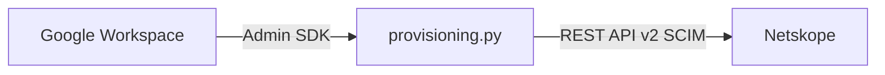

# Google Admin SDK → Netskope SCIM 프로비저닝

Google Workspace / Cloud Identity 사용자·그룹을 Admin SDK Directory API로 읽고, Netskope SCIM v2로 테넌트에 동기화합니다. Google에서 삭제된 그룹/사용자는 다음 실행 때 Netskope에서도 삭제합니다.



## Google 설정

1. Cloud Console에서 [Admin SDK API](https://console.cloud.google.com/apis/library/admin.googleapis.com) 를 활성화합니다.
2. 서비스 계정 JSON 키를 프로젝트 폴더에 둡니다
3. Admin Console → **Security → Access and data control → API controls → Manage Domain Wide Delegation**
4. JSON의 `client_id`(숫자)를 넣고 **OAuth scopes**에 다음을 입력합니다.

```
https://www.googleapis.com/auth/admin.directory.user.readonly,https://www.googleapis.com/auth/admin.directory.group.readonly,https://www.googleapis.com/auth/admin.directory.group.member.readonly
```

5. `.env`의 `GOOGLE_ADMIN_EMAIL`은 사용자/그룹 읽기 권한이 있는 관리자여야 합니다

```bash
cp .env.example .env
```

## Netskope

Settings → Tools → REST API v2 토큰에 `/api/v2/scim/Users`, `/api/v2/scim/Groups` **Read + Write** (DELETE 포함).

## 실행

```bash
python3 -m venv .venv
source .venv/bin/activate
pip install -r requirements.txt

python provisioning.py --test-google
python provisioning.py --dry-run
python provisioning.py
```

### `--test-google` vs `--dry-run`

| | `--test-google` | `--dry-run` |
|---|---|---|
| 하는 일 | Admin SDK 연결만 확인 (사용자·그룹 수 조회) | 동기화 전체를 시뮬레이션 |
| Netskope | 호출하지 않음 | GET만 함 (기존 사용자/그룹 확인). POST/PATCH/DELETE는 안 함 |
| 토큰 | `NETSKOPE_API_TOKEN` 없어도 됨 | 있으면 조회까지, 없어도 Google 쪽 계획만 출력 |
| `sync_state.json` | 안 씀 | 갱신하지 않음 |
| 언제 | DWD·서비스 계정·도메인이 맞는지 | 테넌트를 바꾸기 전에 영향 범위 확인 |

실제 반영은 옵션 없이 `python provisioning.py` 입니다.

삭제 동기화는 한 번 성공적으로 올라간 뒤 `sync_state.json`에 기록된 항목만 대상으로 합니다. Google 그룹이 0개로 조회되면 오인 삭제를 막기 위해 그룹 삭제를 건너뜁니다. `DEPROVISION_MISSING=false`로 끌 수 있습니다.
